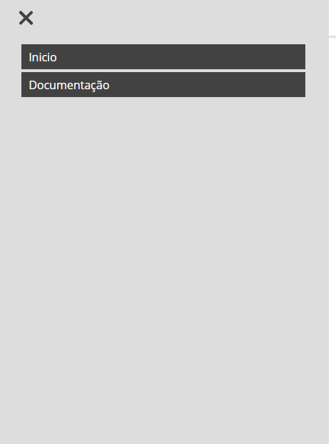
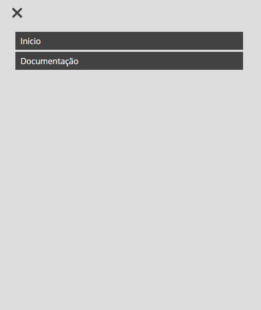
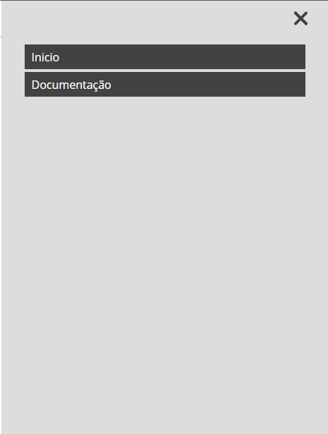

<p align="center">

</p>
<p align="center">

</p>


<h1 align="center">
    <a href="https://ocodigocris.com/occ-grid-system">	
❖ OCC Grid System</a>
</h1>
<h3 align="center">A simple and functional grid system, it has all the necessary features to improve the productivity of your project. With the "occ grid system", you are not stuck with styling a framework, being free to create.</h3>
<h3 align="center">
 <a href="#start">Start</a> •
 <a href="#grid">Grid System</a> • 
 <a href="#grid_layout">Grid Layout</a> • 
 <a href="#flexbox">FlexBox</a> • 
 <a href="#additional">Additional</a> • 
 <a href="#components">Components</a>
</h3>
<h2 align="center"> 
	❖ Status ✎ under development...
</h2>

## Features
<br>
<p>✅ Grid System</p>
<p>✅ Grid Layout</p>
<p>✅ FlexBox</p>
<p>⬜ Documentation</p>
<p>⬜ Additionals</p>
<p>⬜ Components</p>
<br>

<h2 id="start"> Start </h2>
<br>
<h3 align="center"> 
	❖ Status ✎ under development...
</h3>
<br>
<h2 id="grid"> Grid System </h2>
<br>
<h3 align="center"> 
	❖ Status ✎ under development...
</h3>
<br>
<h2 id="grid_layout"> Grid Layout </h2>
<br>
<h3 align="center"> 
	❖ Status ✎ under development...
</h3>
<br>
<h2 id="flexbox"> FlexBox </h2>
<br>
<h3 align="center"> 
	❖ Status ✎ under development...
</h3>
<br>
<h2 id="additional"> Additional </h2>
<br>
<h3 align="center"> 
	❖ Status ✎ under development...
</h3>

<br>
<h2 id="components"> Components </h2>
<br>
<h3 align="center"> 
	❖ Status ✎ under development...
</h3>
<br>

## Navbar
<p align="center"><h3>Nav-1</h3></p>
<p align="center"></p>
<br>

### Navbar responsive
```html
<div class="navbar nav-1">
	<div class="menu">
		<div class="toggle-1">
			<span class="line"></span>
		</div>
		<ul class="menu-nav-1">
			<li><a  href="#">Link 1</a></li>
			<li><a  href="#">Link 2</a></li>
		</ul>
	</div>
	<div class="brand">
		<h1>Occ - Grid System</h1>
	</div>
</div>
```
<br>

**use a `class="nav-1"` in your navbar container**

<br>

### Menu Toggle
<br>
<p align="center"></p><table>
	<tr>
		<td></td>
		<td></td>
	</tr>
</table></p>
<br>

### Slide Menu
<br>
<table>
	<tbody>
		<tr>
			<td><p align="center"><b>Default</b></p></td>
			<td><p align="center"><b>Top</b></p></td>
			<td><p align="center"><b>Right</b></p></td>
		</tr>
		<tr>
			<td>
				<p align="center"></p>
			</td>
			<td>
				<p align="center"></p>
			</td>
			<td>
				<p align="center"></p>
			</td>
		</tr>
		<tr>
			<td>
				<p align="center"></p>
			</td>
			<td>
				<p align="center"></p>
			</td>
			<td>
				<p align="center"></p>
			</td>
		</tr>
	</tbody>
</table>
<br>

### Desktop
<br>
<table>
	<tr>
		<td><p align="center"></p></td>
	</tr>
</table>
<br>
<p align="center"><a href="https://www.ocodigocris.com/occ-grid-system/pages/docs.html#nav-1"></a></p>
